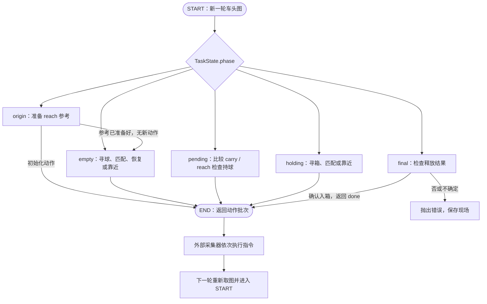
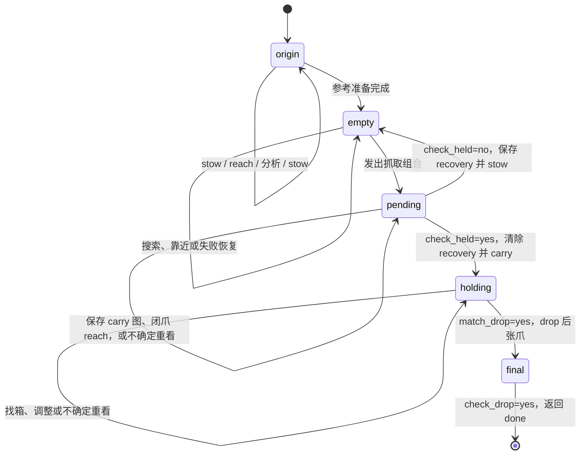
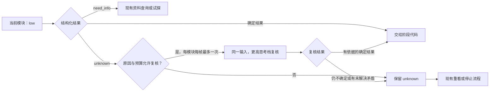

# 模块化 LangGraph Brain

入口是 `--brain langgraph`；沿用[五阶段设计](../langgraph.md)，旧 brain 仍在 `legacy/`。

```powershell
python -m pip install -r requirements-langgraph.txt
python run_collect.py --brain langgraph --episodes 1 --gui --keep-open
```

默认使用项目 `.env` 的兼容 API 端点和模型，发送车头图片、当前小任务和按需申请的样本；不把仿真持球真值、物体坐标、关节回读、俯视图或工具结果文本送给模型。

## 当前实现与验证进度（2026-10-02）

五阶段闭环、九个判断模块、操作经验库与逐轮 review 已实现。当前默认开启思考、`reasoning_effort: low`；最近一次真实模型 GUI（本次修复前）共 35 轮、46 个动作，第 24 轮抓取成功、第 26 轮视觉确认持球，最后因连续无法判断投放条件而停止，未释放球，整次任务未成功。完整数据见[验证记录](../../docs/langgraph-review-followup.md)。

本次已经实现：

- 抓取失败后，`recovery` 保存视觉检查说明，传给抓取匹配与移动规划。失败后尚未执行底盘修正时，程序拦住直接重抓；没有修正依据则有限次重看后停止。
- 分开规划总时长与单条动作时长。目标偏远、对齐且前方畅通时，最多规划 4s 前进，同轮展开为每条最多 2s 的指令；试探、转向和近处调整保持较短计划。

**尚未实现**：可靠的跨帧目标锁定、drop 释放位置参考及闭爪投放预览、自适应提高思考强度。恢复机制和批量移动已有回归测试，尚未重新用真实模型完成 GUI 抓放验证；历史运行不代表新实现的成功率。

阅读顺序：[运行流程](#运行时怎样配合) → [两张流程图](#langgraph-图与-if-else-的关系) → [全部状态字段](#任务状态与记忆) → [恢复与批量移动](#失败恢复和长移动的具体规则) → [思考升级设计](#不确定时提高思考强度设计未启用)。

## 每个文件一句话

| 文件 | 作用 |
| --- | --- |
| `__init__.py` | 导出新 `LangGraphBrain`，方便采集器加载。 |
| `brain.py` | 接收车头新图和实际发送过的指令，维护任务状态并推进图。 |
| `graph.py` | 定义起源、未持球、待判定、持球、最终检查五个 LangGraph 节点及路由。 |
| `stages.py` | 实现五阶段各自的分支、按需申请资料和等待新图的顺序。 |
| `contracts.py` | 定义模块的结构化输入输出、三态判断和程序持有的任务状态。 |
| `capabilities.py` | 按小任务分配模型、prompt 或程序实现，并校验、缓存和记录结果。 |
| `backends.py` | 提供兼容 API 调用及可替换的球心与多边形匹配程序。 |
| `image_context.py` | 统一相机坐标系、动作前后图片顺序及历史参考标签，去重时保留全部角色。 |
| `execution.py` | 检查一次性操作权限，将抓取和投放展开为现有基础工具。 |
| `memory.py` | 保存三类有限经验、原图和独立的调用日志。 |
| `learning.py` | 在本轮定位后分析纯移动，复用目标坐标并保存局部图像变化。 |
| `profiles.yaml` | 为九个小任务分别配置实现方式、模型、短 prompt 和调用上限。 |
| `replay.py` | 在保存的图片上重新运行某个判断模块，不调用机械臂。 |
| `report.py` | 从日志生成按决策轮展开的网页，将模块输入输出、资料查询与执行结果对应起来。 |
| `report_assets/index.html` | 定义逐轮复盘网页的页面骨架。 |
| `report_assets/review.css` | 定义复盘网页的布局与显示样式。 |
| `report_assets/review.js` | 展开实际调用记录，并按原图像素比例绘制球圆和参考区域。 |
| `prompts/find_ball.txt` | 指示模型选择最近的可达球并输出紧贴球体的圆。 |
| `prompts/find_box.txt` | 指示模型定位目标箱口。 |
| `prompts/match_grasp.txt` | 指示模型结合 reach、球轮廓及环境透视判断左右位置、远近和可抓性。 |
| `prompts/plan_motion.txt` | 指示模型申请所需方向经验并选择一次小步移动。 |
| `prompts/check_held.txt` | 指示模型比较 carry 和 reach 两图中的夹持关系。 |
| `prompts/match_drop.txt` | 指示模型结合当前画面和参考资料判断投放条件。 |
| `prompts/check_drop.txt` | 指示模型检查释放后的球是否确实在箱内。 |
| `prompts/analyze_reach.txt` | 指示模型从 reach 图估计球心可抓区域及不确定处。 |
| `prompts/analyze_motion.txt` | 指示模型比较纯动作前后同一静止参照物的变化。 |
| `README.md` | 说明文件职责、运行方式及模块替换方法。 |
| `../langgraph.md` | 保存人类流程原文及共同整理的架构设计。 |
| `../../run_collect.py` | 提供 CLI、执行和记录工具、显示 GUI，并分别记录视觉结果与环境评分。 |
| `../../requirements-langgraph.txt` | 声明新 brain 的可选依赖。 |
| `../../tests/test_modular_langgraph.py` | 验证五阶段、资料权限、模型边界、模块替换和采集器衔接。 |

## 运行时怎样配合

```text
采集器取得 front 图
  → brain 保存新图，核对上批实际指令
  → LangGraph 路由到当前阶段
  → 该阶段只调用需要的小模块
      找球/找箱 → 本轮重新定位一次
      上一段是纯移动 → learning 分析前后图，更新小经验库
      匹配 → 返回左右位置及远近 → 规划移动或执行组合
      缺资料 → 查询经验库 → 命中后重新判断
                           → 未命中则只发一次试探，返回采集器
      有依据 → 检查权限 → 返回底盘动作批次或固定组合
  → 采集器执行并取新图，下一次继续
```

`submit_result` 是每个模型调用唯一可用的结构化结果工具；机器人基础工具由程序调度，模型不能直接改状态或设置 `can_act`。

DeepSeek 开启思考时，API 不支持强制指定工具；适配器使用 `tool_choice: auto` 并提示调用 `submit_result`。可用工具仍只有这一个，返回值仍经过相同的结构校验。

找到目标后，阶段代码会代为申请匹配必需的 reach 资料；移动规划收到同一份 reach 参考、结构化匹配结果，以及上一段纯动作形成的有效经验。换方向或缺其他信息仍由模型申请，每张新图的动作权限仍重新验证；重复申请已有资料会得到明确反馈，不会立即抛异常，申请次数仍有上限。

初始化依次 `stow → reach → 取图分析 → stow`，已有有效 reach 经验时只需初始 `stow`；抓取为 `张爪 → reach → 闭爪 → carry`；待判定保持闭爪做 `reach`；投放为 `drop → 张爪 → 短暂等待`，最后一张新图检查结果。

reach 原图与分析先保存，即使分析尚不能给出可靠区域也回到 `stow`；`ReachAnalysis.valid` 仅表示候选多边形是否可用，不表示原图是否存在，程序匹配后端遇到无有效区域会返回不确定，模型匹配后端则还能查看原图。

最终视觉检查为否或不确定时停止并保存异常；其他阶段连续三次不确定也停止，防止无限消耗调用。工具执行失败会中止当前组合，后续动作不再执行；最多 64 轮决策，可通过 `--max-decisions` 修改。

若模型已收到资料、经一次提醒仍重复申请同一份，程序将其作为当前无法判断而重新观察；连续发生时停止并显示具体原因，不会用同一个缓存回答反复消耗申请次数。

首次空库试探固定为 `0.2` 秒；单条正式动作上限 `2.0` 秒；有经验且目标偏远、对齐、前方畅通时，一次前进计划最多 `4.0` 秒；抓空后尚未调整时，恢复计划最多 `0.6` 秒。均在 profile 配置，模型实际收到适用于当前情形的时长上限。

## LangGraph 图与 if-else 的关系

当前实现确实是**由程序定义转移规则的状态机，节点内部仍使用 if-else**。LangGraph 没有自动替我们理解任务，也没有把规划权交给一个总模型。它目前提供显式节点、条件路由和统一调用入口；记忆是否保留、能否重试、何时调用模型，都仍由代码定义。

下面第一张图表示一次 `brain.decide()` 内实际发生的路由。图的 END 表示“本轮交还执行器”，不是整个捡球任务结束。初始化资料已经准备好时，origin 可以不发动作而直接进入 empty；其他阶段一般发出一批动作后结束本轮。代码中的条件路由表允许多个节点目标，实际行为受 `stages.py` 的返回值约束。



第二张图表示**跨多轮保留的任务阶段**。箭头由程序根据模块结果选择；图中简化了每个阶段内的资料查询、试探与有限次 unknown 处理。



这两层不能混淆：`GraphState` 只有 `task` 和 `actions`，图节点传递的是它；跨轮状态实际保存在 `LangGraphBrain.state` 的 `TaskState` 中。没有配置 checkpointer，也没有自动持久化恢复、并行节点或自动思考升级。日志保存全部过程，但重启任务会重新初始化状态。

因此替换 LangGraph 为一个按 phase 分发的普通 Python 函数，当前大部分行为仍可保持。保留 LangGraph 的价值在于后续可以把“恢复决策”“升级复核”等独立步骤变成可观察节点；仅增加节点数量不会自动改善识图或规划。当前先保持五阶段边界，把两个具体缺口修好。

## 任务状态与记忆

当前流程控制由程序完成：`graph.py` 根据 `TaskState.phase` 选择节点，`stages.py` 的分支决定调用什么模块、怎样修改状态以及发出什么指令。模型返回结构化结果，不直接修改阶段。LangGraph 节点和模型调用不是一一对应关系。

| 数据 | 保存什么 | 怎样进入后续模型输入 |
| --- | --- | --- |
| `TaskState` | 本任务的阶段、子步骤、当前目标与判断、受保护的 carry 图、上一段动作及权限等。 | 阶段代码选择需要的字段，构造 `CapabilityInput`；不会把整个状态直接交给模型。 |
| `ExperienceStore` | reach、前进后退、左右转向三类操作样本，每类最多两条。 | `Stages.context()` 提供目录摘要，`resolve()` 按阶段依赖或模型申请加载详细样本。 |
| `RunLog` 与 Recorder | 每次调用的输入输出、prompt、图片、实际动作、工具反馈和最终结果。 | 保存供网页复盘及离线重放，不自动拼进下一次 prompt；工具反馈不进入模型。 |

主要运行状态定义在 `contracts.py`，由 `brain.py` 和 `stages.py` 维护：

| TaskState 字段 | 初始值 | 写入方、含义与生命周期 |
| --- | --- | --- |
| `phase` | `origin` | 阶段函数修改；选择五个任务阶段之一，跨轮保留。 |
| `started` | `False` | origin 发出本任务第一次 stow 时置 True，防止每轮重新初始化。 |
| `step` | `start` | 阶段内进度。origin 使用 check_reach/reach_image/stowed；pending 使用 capture_carry/check_reach；empty、holding 使用 search；final 使用 check。它不是另一个模型。 |
| `can_act` | `False` | `authorize()` 检查资料后开启；`issue()` 消耗，下一轮也重置。固定初始化动作走专用程序分支。 |
| `target` | `None` | 本轮 `find_ball/find_box` 的目标；新定位覆盖，未见目标时清空。球圆、路径与标签仍是模型估计。 |
| `target_frame_id` | `None` | 记录 target 属于哪张图，避免运动学习复用不属于前图的坐标。 |
| `assessment` | `None` | `match_grasp/match_drop` 的空间判断：status、alignment、distance、note。新定位时清除旧判断。 |
| `learned_frame_id` | `None` | `learn_motion()` 标记已经处理的当前帧，防止同帧反复分析同一段移动。 |
| `carry_frame` | `None` | pending 保存抓取后的 carry 图，供后续闭爪 reach 图比较；下一次抓取检查覆盖它。 |
| `frame` | `None` | `brain.decide()` 保存的当前车头图引用；每轮更新。 |
| `last_transition` | `None` | `_feedback()` 写入 before、commands、after、before_target；对应最近一批实际发送的指令及前后图，不读取工具结果文字。 |
| `request` | `None` | `resolve()` 记录最近一次资料请求；下一轮清空。请求种类为 reach/translation/rotation。 |
| `permission` | `None` | 一次性权限元组：当前 frame.id、phase、目标序列化值、动作名。禁止拿另一帧或另一方向的许可执行动作。 |
| `pending_commands` | `[]` | `issue()` 保存本轮指令列表；下一轮与 history 新增的指令名和参数逐项核对，再清空。 |
| `loaded` | `[]` | 本帧已经加载的经验样本，用于规划和权限检查；下一轮清空，不能永久获得操作许可。 |
| `unknown_count` | `0` | 连续不确定计数，达到 max_unknown 停止；正常移动、确定持球状态等分支重置，不是历史失败总次数。 |
| `pose` | `unknown` | 根据自己发送的 arm_pose 指令维护的姿态名，用于标注图片；不是仿真关节真值。 |
| `final_verdict` | `None` | final 保存 check_drop 的 yes/no/unknown，写入最终记录。 |
| `recovery` | `None` | check_held=no 后保存下表的恢复记录；收臂、换帧、查询资料不会清除；成功持球或新任务 reset 时清除。 |

`Frame` 包含图片 id、本地路径、配置指纹 config_id、指令姿态名 pose 和宽高。发送模型时保留标识与尺寸、移除本地路径，图片内容按 CURRENT / BEFORE / REFERENCE 明确标注。

| recovery 字段 | 来源和含义 |
| --- | --- |
| `kind` | 当前固定为 grasp_failed，预留明确的事件类别。 |
| `note` | 原样保留视觉 check_held 的说明，最多 340 字符；没有说明时写明失败原因未知，不注入执行器测距或工具反馈。 |
| `failed_frame_id` | 得到未持球结论的 reach 图 id，用于追溯；不会自动把历史图再次发给模型。 |
| `failures` | 自上次确认持球或任务开始以来的抓空确认次数。 |
| `correction_commands` | 最新一次失败后、在新帧核对过的最近一批底盘指令。空列表表示尚未调整；非空只证明发出过调整，不证明效果正确。再次抓空时归零。 |

模型并不直接收到整个 TaskState。`CapabilityInput` 是单次调用的白名单上下文：

| 输入字段 | 用途 |
| --- | --- |
| `frame` | 必需的当前图。 |
| `target / previous_target / comparison_target` | 当前共享目标、仅有文字标签的上一目标身份、运动对比所用的前图目标。 |
| `assessment / intent / task` | 空间匹配结论、当前移动目的、用户任务，按模块传入。 |
| `summary / evidence` | 经验目录与本次实际加载的详细样本，目录非空不等于已经收到样本。 |
| `comparison / commands` | 指定的前图及待分析的已执行动作；用于持球或运动对比。 |
| `max_seconds / max_command_seconds` | 本次可规划总时长与单条底盘动作上限。 |
| `info_feedback` | 同一帧内重复申请已提供资料时的提示，不是跨轮记忆。 |
| `recovery` | 仅传给 match_grasp 和 plan_motion 的任务内失败记录；定位、持球检查与运动样本分析不接收它，继续独立观察图像。 |

## 失败恢复和长移动的具体规则

抓取失败后的路径是：`check_held=no → 保存 recovery → stow → 新图定位/匹配 → 恢复规划 → 实际移动 → 新图核对指令 → 再判断能否抓取`。即使新一轮 match_grasp 再次返回 yes，只要 recovery 尚无 correction_commands，也不会直接重抓。匹配或恢复规划看不清则 observe，连续不确定到上限会停止，不会默认后退。修正所需方向经验缺失时仍只做 0.2s 试探。

失败说明在同一轮的多个调用、资料申请和后续换帧中保留，不会被第一条 API 调用“读完即消耗”。实际底盘修正在 `_feedback()` 里确认后，更新 correction_commands；再次抓空重新要求修正。只伸臂、收臂或原地 observe 不算底盘调整。新目标仍需当前图重新判断，旧失败说明不等于当前目标的坐标或真值。

规划结果 `Motion.seconds` 表示总时长，由程序核验本次上限后展开。默认 `max_motion_seconds=2.0` 是单条上限，`max_plan_seconds=4.0` 是远处对齐目标的前进总上限，`max_recovery_seconds=0.6` 是首次恢复调整上限。转向、后退、搜索和近处移动不使用 4s 长计划；超过本次上限会明确报错，不静默截短。旧 profile 未设置新字段时，总上限沿用旧的单条上限。

例如模型规划 forward 4s，`motion_batch()` 返回两条 forward 2s，采集器在同一决策轮依次执行，逐条记录图片，任一工具失败即中止剩余指令。没有中间模型调用，也没有中途根据新图重规划；底层驱动原有的每条动作结束停车行为仍保留，因此它不是连续不停车的单条 4s 控制。

下一轮以整批指令和前后图形成移动样本，经验库用实际指令总时长计算图像变化率。它仍是这段动作附近深度下的局部经验，不因合并执行就变成全局线性速度模型。新 review 的模块输入区域会展示 recovery 和两个时长上限；旧运行记录保持原样。

## 不确定时提高思考强度（设计，未启用）

用户选择本次先说明设计，不启用自动升级。当前每个模块仍使用 profile 指定的固定 low 设置；API 重试只处理请求或结构校验失败，不能称为提高思考强度。

适合的最小扩展位于 `Capabilities.call()`：模型先用低档返回结构化结果；若明确给出 unknown，并且问题属于“已有图片和资料需要复核”，程序允许同一模块在同一组证据上用配置支持的更高档再判断一次。阶段只消费最后结果，不增加机器人动作，不重新跑整轮，也不让模型修改任意 API 配置。



要实现这项设计，至少应补齐以下约束：

- 区分缺资料、遮挡/视野缺失和推理不确定；目前只有 unknown + note，不足以稳定决定升级原因，宜增加受限的原因枚举。
- 升级由程序控制为配置中的一个档位，设置单次与全任务次数、时间/token 预算；不反复自我升级。
- 保留两次输入输出、档位、用量、升级原因及关联 id，分别缓存不同档位的调用，让 review 能比较，而非覆盖第一次结果。
- 更高档的结论仍需通过同样的结构、资料和动作约束；低高档冲突时不能只因后者更贵就当作事实。
- 缺少 drop 释放位置图像时，提高思考强度也不能补出看不到的证据，应请求新的观察或保留 unknown。

因此“模型表达自己不确定，程序允许一次更深入复核”可以独立加入，工程上不要求重写状态机。它是否改善结果需要用同一批人工核对的图片评估；当前尚未做此实现或实验。

## 换模型、prompt 或程序

编辑 `profiles.yaml` 的单个条目即可，例如：

```yaml
capabilities:
  match_grasp: {prompt: match_grasp.txt, backend: llm}
  check_held: {prompt: check_held.txt, model: your-vision-model, max_tokens: 1600}
```

其余七个条目仍需保留；`model: null` 继承项目模型，各模块使用同一个已配置端点。模型需支持图片和工具调用。当前默认 `thinking: enabled`、`reasoning_effort: low`，`max_tokens: 8192` 为思考过程和结果留出预算；没有自动更换模型的后备策略。此前 GUI 验证记录使用的是 `thinking: disabled`，应按各次日志中的 profile 区分。

配置文件可用 `--brain-profile` 指定；相对 prompt 路径位于该 YAML 所在目录下的 `prompts/`，也可写绝对路径。试验经验库用 `--brain-memory output/my-experiment` 隔离。

`polygon` 是保留的实验插口，本次未启用；它需要上游球心、有效参考区域及一致配置，不负责识别球或验证物理可达性。要增加其他算法，在能力分发处接入相同的输入输出接口即可，无需改图的阶段和转移。替换定位器时满足 `BallDetection`；替换抓取判断时满足 `SpatialMatch`；替换 API 时实现 `invoke(...)` 与 `close()`。

## 各小模块看什么、输出什么

| 模块 | 主要输入 | 输出及影响 |
| --- | --- | --- |
| `find_ball` | 当前原图、任务、上一目标的身份描述 | 可见性 + 球圆 + 路径，成为本轮共享目标。 |
| `find_box` | 当前原图、任务、上一目标的身份描述 | 当前箱口目标和路径。 |
| `analyze_reach` | reach 原图 | 候选投影多边形和说明，存入经验库；不等于实测抓取标定。 |
| `analyze_motion` | 动作前后原图、实际指令、两帧已定位目标 | 判断同一静物是否可作参照，输出有效性和分析。 |
| `match_grasp` | 当前原图、共享球圆、reach 样本 | 左右位置、远近、yes/no/unknown；yes 触发抓取组合。 |
| `plan_motion` | 当前原图、共享目标、匹配结论、reach 与方向经验 | 一个方向和秒数，或资料申请/不确定。 |
| `check_held` | carry 前图、闭爪 reach 后图 | 是/否/不确定，决定 carry、stow 或有限次重看。 |
| `match_drop` | 当前原图、共享箱口、reach 参考 | 投放左右位置、远近及是否适合释放。 |
| `check_drop` | 释放后的当前原图 | 是否入箱；否则停止保存异常。 |

`alignment` 的 left/right 表示**目标相对预期抓取/投放位置**偏左/偏右；不表示静物经过转向后的图像位移。`distance` 为 far/ready/too_close/unknown。它们仍由模型判断，程序只校验结构，没有新增几何可抓性拦截器。

球圆约定：`center=(像素x/W, 像素y/H)`，`radius=像素半径/W`；例如 320×240 图片上半径 16 像素，radius 为 0.05。`visibility=partial` 表示被遮挡或出画。网页按真实 W/H 绘制圆，圆只是估计轮廓而非像素分割结果；旧日志没有半径就显示明确标注的定位点。叠加层仅供人查看，模型接收原图和 JSON。

运动分析若选择 `source=shared_target`，只判断两次检测是否同一静止目标，不重新输出坐标；程序从两帧检测复制圆心，同时保存圆半径变化。若选择 `background`，可独立定位同一背景箱角/墙角；禁止借此再次定位球。检测不同球、球被推或原图不支持定位时应判无效，模型若错误认同仍会污染经验，这项可靠性需要实测。

## 数据与重放

每次 `--brain langgraph` 运行结束后（包括正常捕获的失败），会在该集的 `review/index.html` 自动生成逐轮网页，直接用浏览器打开即可。页面按**一次 brain 决策为一轮**组织：模型当前图、按顺序的模块调用、实际 prompt 与 JSON、收到的经验样本、重试错误、最终指令及执行前后图都可展开查看。工具 OK 只表示工具执行完成；俯视图和执行器反馈仅供人复核，不会因此成为模型输入。数值矛盾提示也只用于复核，不修改决策策略。

新记录通过 `round_started` 明确轮次，`meta.json` 的 `brain_run` 将采集记录关联到模型日志；旧记录可按 transition 边界恢复轮次。需要重新生成或本机打开网页时：

```powershell
python -m brains.langgraph.report <episode目录> --serve
# 旧记录需显式指定：--events <brain_data/runs/id/events.jsonl>
# 浏览器打开 http://127.0.0.1:8768/；不发起模型请求，不执行动作。
```

网页包含生成时的记录快照，不是实时控制台；运行中被强制杀掉的进程可在日志可读时用上述命令手动生成。

默认 `output/langgraph/experience.json` 保存 reach、前进后退、左右转向三类经验，每类最多两条；新任务保留经验，相机/臂/运动配置指纹变化后不复用旧经验，真机换装时还应更新 `calibration_id`。

有效运动样本保存 `image_rate`：程序用前后坐标差除以实际动作秒数计算局部图像变化率，共享球还保存 `observation`（两帧定位）与半径比。它不是米/秒：透视下深度不同，像素变化率会不同；远处样本不应直接外推到近球。没有实现独立的距离/剩余前进秒数估计器。每类仍最多两条，同方向新有效样本替换旧样本；这种小容量不构成完整速度模型。

所有坐标以各张车头相机图像为参考，左上 `(0,0)`、x 向右、y 向下，右下 `(1,1)`；前后图按 `BEFORE → AFTER CURRENT` 提交，经验图片标为 `REFERENCE`。当前协议 v3：旧协议经验首次载入时原样归档到 `experience-before-camera-v3-*.json`，旧运动分析不再用于决策；reach 保留原图、撤回旧多边形，并在起源阶段用新协议重新分析一次。新运动须重新采样。旧网页仍可重建；旧调用重放使用的是新 prompt/新输出协议，不会伪装成旧模型原始结果。

寻球和寻箱只接收上一目标的身份描述，不接收旧坐标或旧路径结论；每帧重新定位，未看见或无法确认时清空当前目标。这个约束消除了旧坐标输入的干扰，不能保证视觉模型的像素定位精度。

**尚无可靠的跨帧目标锁定**：多球场景下，重新选择最近球可能切换对象；“本轮共享坐标”仅防止同帧各模块独立定位，不保证前后两帧同一球。运动分析须再判断身份对应，但当前仍依赖模型，新 GUI 已暴露误认并入库的情况，详见 [本次验证记录](../../docs/langgraph-review-followup.md)。

所有输出的 `note` 最多 **340 字符**（包括空格和标点，不是 340 词）；prompt 和 schema 同时说明，超限仍校验失败，绝不截断。失败后按配置重试，并反馈具体字段错误；超过重试次数就停止。`invalid_result` 保存完整结果文本、字段错误及实际长度，不记录请求头和密钥。GUI 的 `Stop` 显示实际结束原因，具体异常同时保存在运行记录及每集 `meta.json`。

`output/langgraph/runs/<id>/frames/` 保存原始车头图，`events.jsonl` 保存模块输入、实际 prompt、模型/配置版本、输出、每次 API 用量、耗时、指令及最终结果；密钥不写入日志，历史日志也不会自动成为模型上下文。

先在 `events.jsonl` 找一个 `capability_input` 的 `call_id`，然后可用另一份模块配置重放：

```powershell
python -m brains.langgraph.replay output/langgraph/runs/<id>/events.jsonl --call-id <id> --profile <profile.yaml>
```

重放可能调用配置的模型 API，但不执行机器人动作；比对时应使用人工核对标签和实际执行结果，不把另一个模型的回答直接当作真值。仿真 `environment_success` 与 `brain_success` 分开保存，两者均为真才将这一轮标为成功。

投放尺度目前仍依赖视觉判断，reach 参考不能单独标定 drop 的落点；这属于后续需要用实际样本评估的能力模块，而不是流程图保证的结果。

首次两轮 GUI 的实际表现、停止原因及调用成本见 [验证记录](../../docs/langgraph-gui-validation.md)；单元测试通过不等于已验证抓取投放成功。
